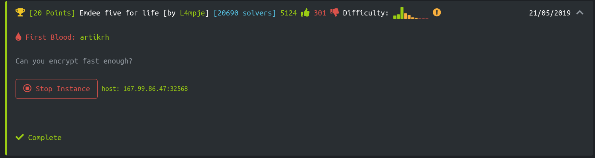
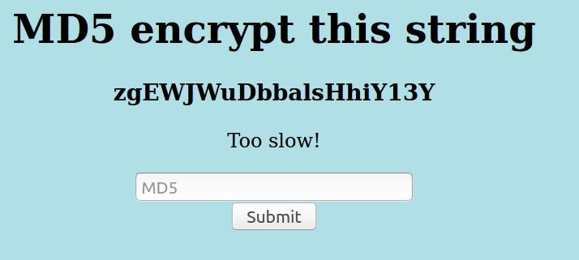
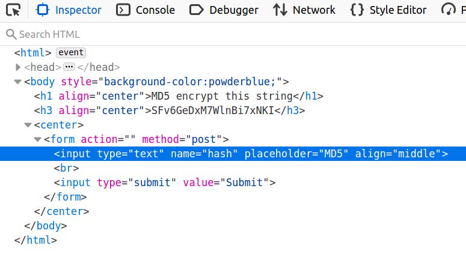
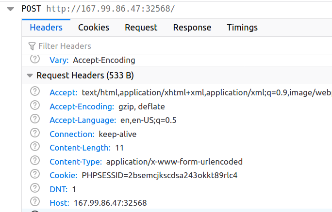

# Emdee five for life
In this web challenge, we are given a website and expected to get the flag by encrypting the server generated value using MD5 and send it fast enough.




# TL;DR
- This is an easy scripting challenge.
- Steps: Using nodejs, make a GET a request to the server, get the generated input value, MD5 it, and make a POST request with the encrpyted value using the same `Cookie` value.
- Note to self! Using nodejs was not comfortable as I thought it would be. Next time, try to use python and modules like `requests` and `hashlib`.

# How to get the flag?
Each time we make a request, the input value to get the flag changes. Copy-pasting by hand and sending the value right away, obviously, does not help. There is a POST '/' method and `hash` is the only form input value. There is also a cookie value that is set in the request headers. We probably need to re-use cookies while we do the POST request. Otherwise, we may get an incorrect response for the generated value.



I decided to use `nodejs` for this challenge, and a fast MD5 encryption library [1]. Running `emdee.js` gave me the flag:

```bash
$ node emdee.js

<html>
<head>
<title>emdee five for life</title>
</head>
<body style="background-color:powderblue;">
<h1 align='center'>MD5 encrypt this string</h1><h3 align='center'>0yI0DwQ34C1Q6mrYfl1h</h3><p align='center'>HTB{N1c3_ScrIpt1nG_B0i!}</p><center><form action="" method="post">
<input type="text" name="hash" placeholder="MD5" align='center'></input>
</br>
<input type="submit" value="Submit"></input>
</form></center>
</body>
</html>
```


# References
- [1] https://www.npmjs.com/package/spark-md5